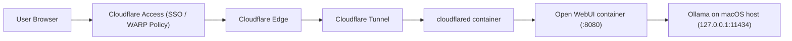
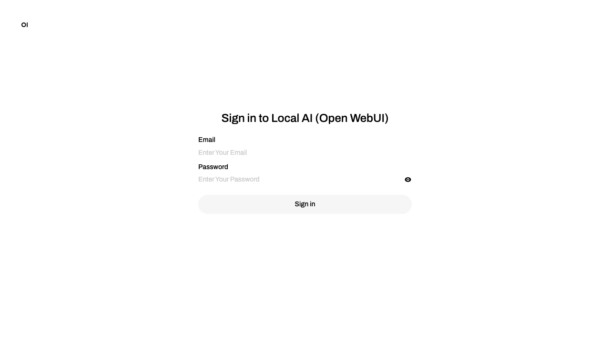

# Ollama + Open WebUI + Cloudflare Tunnel (macOS-first)

## 1) Architecture overview
- `ollama` runs on the macOS host at `127.0.0.1:11434`.
- `open-webui` runs in Docker and connects to host Ollama via `OLLAMA_BASE_URL`.
- `cloudflared` runs in Docker and forwards `https://ai.<your-domain>` to `open-webui:8080`.
- Only Open WebUI is exposed through Cloudflare Tunnel. Ollama is never exposed publicly.

### Infrastructure diagram


Traffic flow summary:
1. The browser reaches `https://ai.example.com`.
2. Cloudflare Access enforces identity/device policy before any origin traffic.
3. Cloudflare Tunnel forwards traffic to the local `cloudflared` container.
4. `cloudflared` proxies to Open WebUI.
5. Open WebUI calls Ollama on the host for model inference.

## 2) Prerequisites
- macOS with [Homebrew](https://brew.sh/)
- [Ollama](https://ollama.com/download)
- Docker Desktop (or Docker Engine + Compose plugin)
- Cloudflare account with a managed domain
- You must own and manage the parent domain in Cloudflare DNS before using a hostname like `ai.example.com` (replace `example.com` with your real domain)
- `cloudflared` CLI installed locally for tunnel bootstrap

Install core tools on macOS:
```bash
brew install cloudflared
brew install --cask docker
```

## 3) Quick start
1. Copy environment template:
```bash
cp .env.example .env
```

2. Edit `.env` values:
- `DOMAIN`
- `HOSTNAME` (for example `ai.example.com`)
- `TUNNEL_ID`
- `TUNNEL_CREDENTIALS_FILE`

3. Ensure scripts are executable:
```bash
chmod +x scripts/*.sh
```

4. Start everything with one command:
```bash
make up
```
`make up` renders `cloudflared/config.rendered.yml` from `.env` before starting containers.

5. Check status:
```bash
make status
```

## Open WebUI screenshot


## 4) Cloudflare Tunnel creation commands
Run these on your local machine (outside containers):

```bash
cloudflared tunnel login
cloudflared tunnel create ollama-webui
```

Capture the generated tunnel ID and credentials JSON filename from `~/.cloudflared/`.

Copy credentials into this repo:
```bash
cp ~/.cloudflared/<TUNNEL_ID>.json ./cloudflared/
```

Set `.env`:
- `TUNNEL_ID=<TUNNEL_ID>`
- `TUNNEL_CREDENTIALS_FILE=<TUNNEL_ID>.json`

## 5) DNS routing
Create DNS route for your hostname:
```bash
cloudflared tunnel route dns ollama-webui ai.example.com
```

Set `.env` with `HOSTNAME=ai.example.com`.

`cloudflared/config.yml` routes traffic to `http://open-webui:8080` and falls back to HTTP 404 for unmatched ingress.

## 6) Cloudflare Access policies (WARP vs SSO)
Create an Access application for `https://ai.example.com`:
- App type: Self-hosted
- Domain: `ai.example.com`

Policy option A (SSO-only):
- Include: your IdP users/groups (Google, GitHub, Okta, etc.)
- Require: valid identity login

Policy option B (WARP-required, VPN-like):
- Include: your IdP users/groups
- Require: `Gateway -> WARP` posture/connection rule
- Result: only devices connected through Cloudflare WARP can access

You can combine both: require SSO identity and WARP device state.

## 7) Open WebUI user management
Cloudflare Access and Open WebUI accounts are separate controls:
- Cloudflare Access decides who can reach the site at all.
- Open WebUI decides who can sign in and what they can do after they get through Access.

Current behavior for this repo:
- Open WebUI account data is stored in the persisted Docker volume mounted at `/app/backend/data`.
- On a fresh Open WebUI instance, the first account created becomes the Administrator.
- Subsequent sign-ups default to the `pending` role and require administrator approval before the user can use the app.

To add a user with the current repo setup:
1. Sign in to Open WebUI as an administrator.
2. If sign-up is disabled, re-enable it in `Admin Panel -> Settings -> General`.
3. Have the new user register at the local or remote Open WebUI URL.
4. Approve the account in `Admin Panel -> Users` by changing the role from `pending` to `user` (or `admin` only if needed).

To remove or disable access:
- Immediate access block: remove the person from the Cloudflare Access policy so they cannot reach the site.
- Open WebUI deactivation: in `Admin Panel -> Users`, change the account role back to `pending`.
- Full automated lifecycle management is possible through SCIM, but this repo does not currently enable or configure SCIM.

Operational notes:
- This repo does not currently pre-seed Open WebUI admin accounts through environment variables.
- Open WebUI supports headless first-admin creation on a fresh install with `WEBUI_ADMIN_EMAIL`, `WEBUI_ADMIN_PASSWORD`, and optional `WEBUI_ADMIN_NAME`, but that would need to be wired into `docker-compose.yml` before use here.
- Deleting the `open-webui` Docker volume removes all Open WebUI state, including all users and chats. Treat that as a full reset, not a normal offboarding workflow.

## 8) Troubleshooting
- Ollama not starting:
  - Verify `ollama` exists: `which ollama`
  - Try manual run: `ollama serve`
  - Inspect logs: `tmp/ollama-serve.log`, `tmp/ollama-serve.err`

- Open WebUI cannot reach Ollama:
  - Confirm host service: `curl http://127.0.0.1:11434/api/tags`
  - Confirm container env: `OLLAMA_BASE_URL=http://host.docker.internal:11434`

- Cloudflare tunnel down:
  - `docker compose logs -f cloudflared`
  - Check rendered config: `cloudflared/config.rendered.yml`
  - Check credentials file exists at `cloudflared/<TUNNEL_ID>.json`

- Remote URL prompts for Access:
  - Expected when Access policy is enabled
  - Authenticate or connect WARP based on policy

## 9) Security notes
- Never expose Ollama (`11434`) to the internet.
- Keep tunnel credentials JSON private; it is gitignored by default.
- Prefer Access policies with least privilege.
- Rotate tunnel credentials if leaked.

## 10) Linux note
On Linux, `host.docker.internal` may require setup. Alternative:
- Use Docker host gateway mapping or
- Set `OLLAMA_BASE_URL` to a reachable host IP (for example `http://172.17.0.1:11434`).
